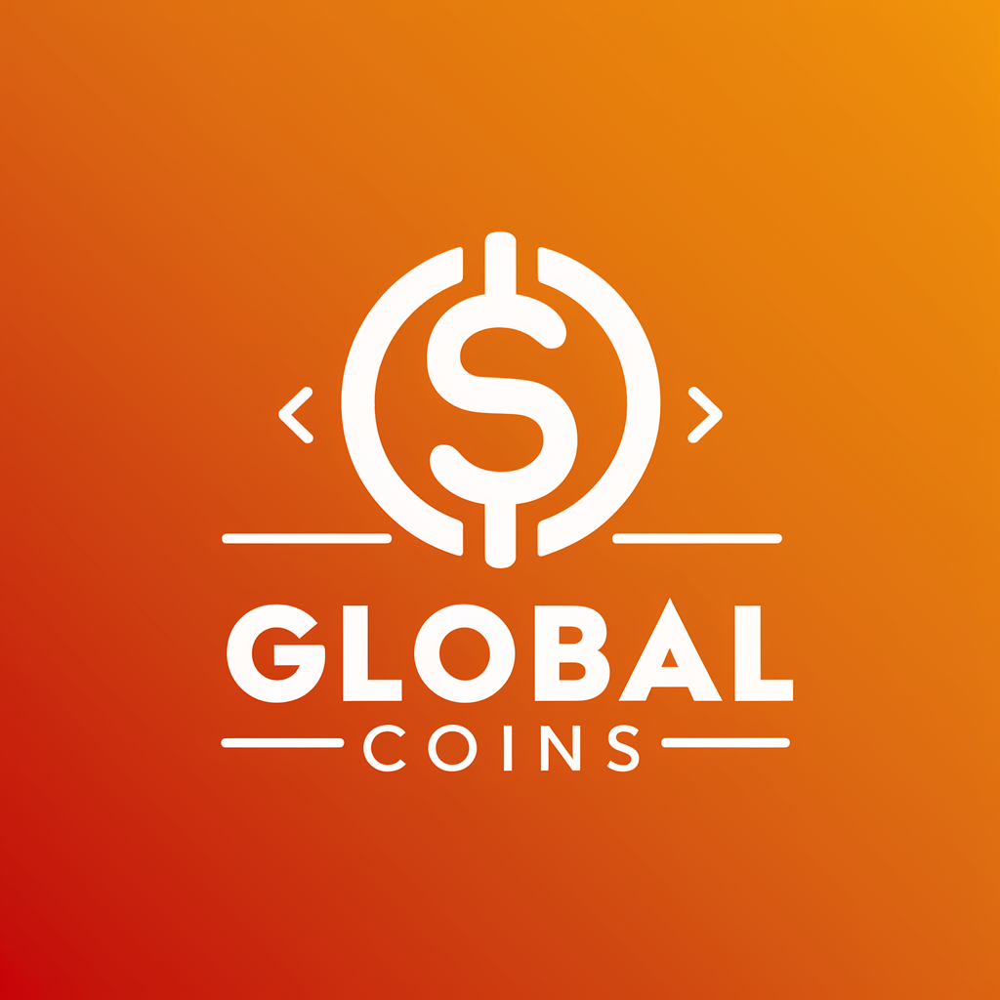
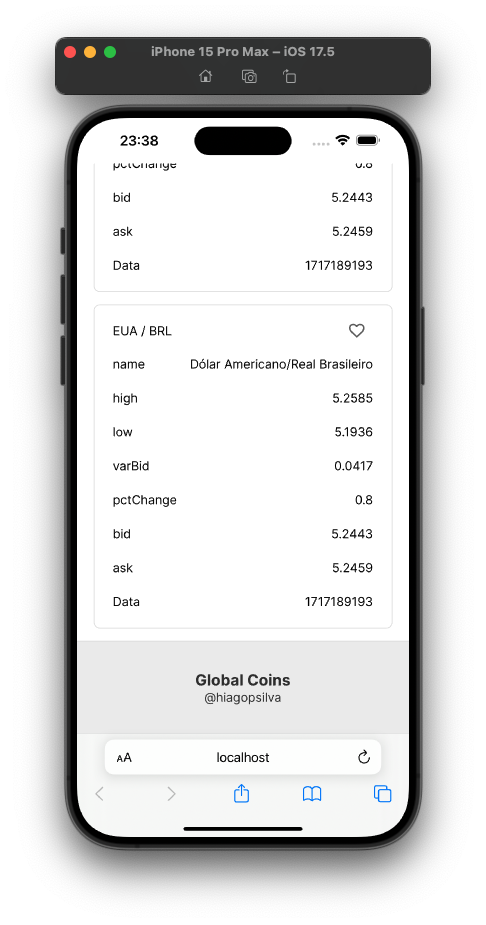

<div style="text-align:center">
  
  <h3>Global Coins</h3>
</div>


## Descrição

Este é um projeto prático desenvolvido como parte de um processo seletivo. O objetivo é demonstrar habilidades técnicas e práticas em desenvolvimento web utilizando React com Next.js no frontend, e Material-UI para a estilização dos componentes. O projeto utiliza as rotas padrão fornecidas pelo Next.js e layout responsivo.

## DEMO
<div style="display:flex;justify-content:center;align-items:center">
    
    
</div>

## Tecnologias Utilizadas

- React
- Next.js
- Material-UI

## Configuração do Projeto

Para executar este projeto localmente, siga estas etapas:

1. Certifique-se de ter o Node.js e o npm instalados na sua máquina.

2. Clone este repositório:

    ```
    git clone https://github.com/hiagopsilva/globalcoins-web.git
    ```

3. Navegue até o diretório do projeto:

    ```
    cd globalcoins-web 
    ```

4. Instale as dependências:

    ```
    npm install
    ```

5. Inicie o servidor de desenvolvimento:

    ```
    npm run dev
    ```

6. Abra seu navegador e acesse [http://localhost:3000](http://localhost:3000) para ver o projeto em execução.

## Funcionalidades

O frontend inclui as seguintes funcionalidades:

- CRUD do usuário.
- Visualizar as 10 moedas.
- Favoritar moedas.
- Visualizar o histórico de cotação de moedas.
- Atualização de dados RealTime.

## Licença

Este projeto está licenciado sob a [MIT License](https://opensource.org/licenses/MIT).
